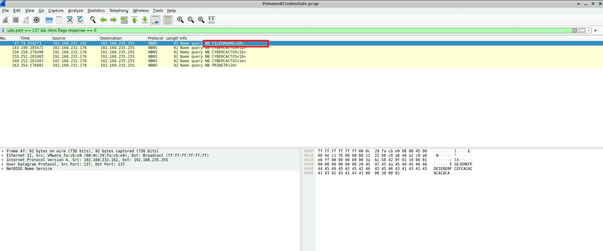
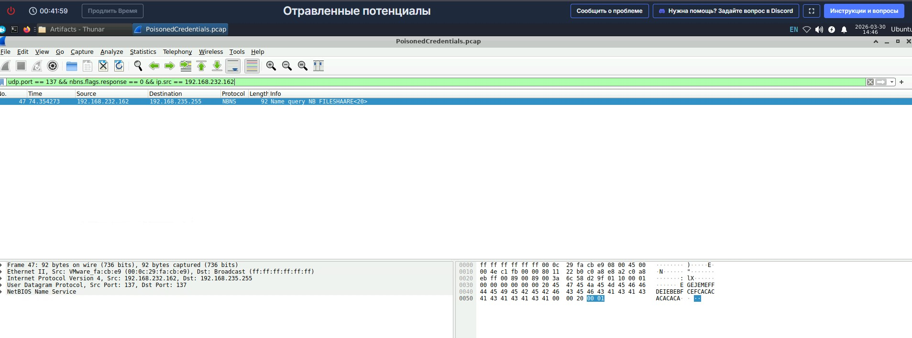
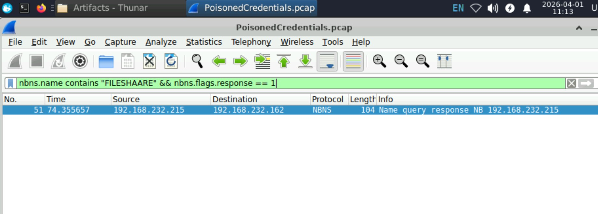
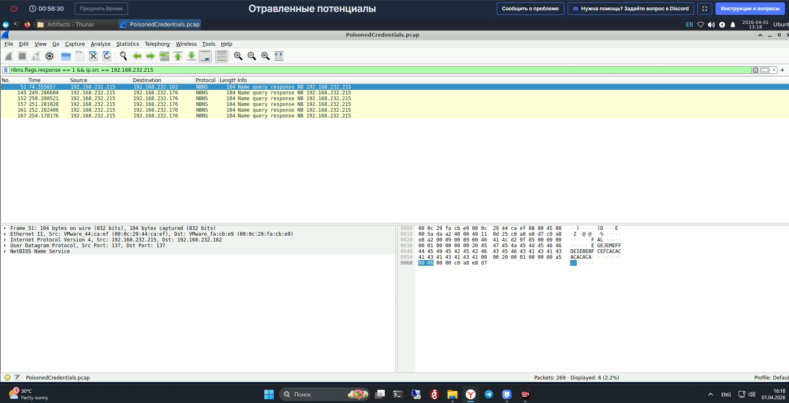
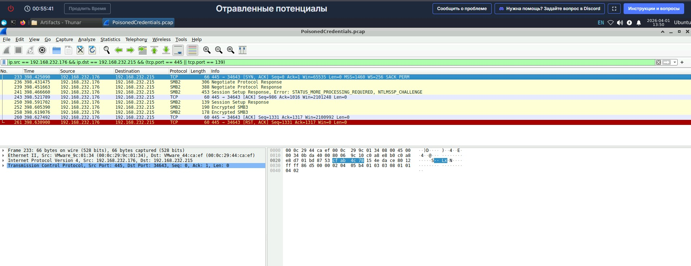
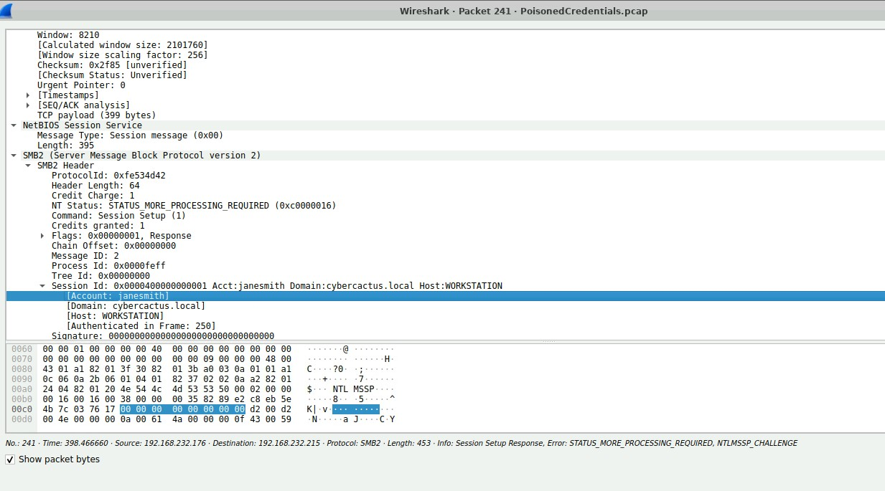
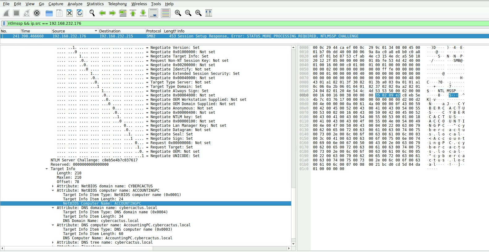

# 🔍 CyberDefenders: SOC Level 1

## Room: PoisonedCredentials Lab

**URL:** https://cyberdefenders.org/blueteam-ctf-challenges/poisonedcredentials/

**Цель:** Проанализировать сетевой трафик на предмет атак LLMNR/NBT-NS, выявить скомпрометированные учётные записи и затронутые системы.

**Инструменты:** Wireshark

**Ход решения:**

---

### Q1: Запрос с опечаткой от 192.168.232.162

**Шаги:**

1. Statistics → Protocol Hierarchy — обнаружено много NBNS/LLMNR-трафика (признак атаки)
2. Фильтр: `udp.port == 137` — только NBT-NS трафик (порт 137 UDP)
3. Фильтр: `udp.port == 137 && nbns.flags.response == 0` — оставляем только запросы (не ответы)
4. Визуальный поиск опечаток в столбце Info — найдено имя `FILESHAARE`
5. Фильтр по IP жертвы: `udp.port == 137 && nbns.flags.response == 0 && ip.src == 192.168.232.162`
6. Подтверждена опечатка в имени запроса

**Флаг/Ответ:** `FILESHAARE`

**Скриншоты:**

---

### Q2: IP-адрес неавторизованного устройства

**Вопрос:** Какой IP-адрес у устройства, которое действует как неавторизованный субъект?

**Шаги:**

1. Используем найденное имя с опечаткой: `FILESHAARE`
2. Фильтр: `nbns.name contains "FILESHAARE" && nbns.flags.response == 1`
3. Анализируем ответ — ищем пакет типа "Name query response"
4. Определяем отправителя ответа — это и есть злоумышленник

**Флаг/Ответ:** `192.168.232.215`

**Объяснение:**

- Жертва (192.168.232.162) отправила запрос "Кто такой FILESHAARE?"
- Злоумышленник (192.168.232.215) ответил "Это я!" и перехватил аутентификацию
- Это не легитимный файловый сервер, а атакующее устройство

**Скриншоты:**

---

### Q3: Все вредоносные ответы злоумышленника

**Вопрос:** Найти все вредоносные ответы, которые отправил злоумышленник.

**Шаги:**

1. Фильтр: `nbns.flags.response == 1 && ip.src == 192.168.232.215`
2. Анализируем столбец Destination (получатель)
3. Находим все IP-адреса, которым ответил злоумышленник

**Флаг/Ответ:** `192.168.232.176` (вторая жертва)

**Объяснение:**

- Злоумышленник ответил не только первой жертве (162), но и другому компьютеру (176)
- Это значит, что он перехватил несколько запросов с опечатками

**Скриншоты:**

---

### Q4: Имя пользователя скомпрометированной учётной записи

**Вопрос:** Какое имя пользователя было у учётной записи, которую взломал злоумышленник?

**Шаги:**

1. Фильтр: `ip.src == 192.168.232.176 && ip.dst == 192.168.232.215 && (tcp.port == 445 || tcp.port == 139)`
2. Ищем пакет SMB2 Session Setup Response
3. Раскрываем: SMB2 → Session Id → Account
4. Находим поле Account Name

**Флаг/Ответ:** `janesmith`

**Объяснение:**

- После перехвата хеша, жертва (176) автоматически отправила SMB-аутентификацию злоумышленнику
- В пакете NTLMSSP содержится имя пользователя и домен
- Domain: cybercactus.local, Host: WORKSTATION

**Скриншоты:**

---

### Q5: Имя хоста скомпрометированного компьютера

**Вопрос:** Какое имя хоста у компьютера, к которому злоумышленник получил доступ через SMB?

**Шаги:**

1. Фильтр: `ip.src == 192.168.232.215 && (tcp.port == 445 || tcp.port == 139)`
2. Находим пакет Session Setup Response
3. Раскрываем: SMB2 → Security Blob → NTLMSSP → Target Info
4. Ищем: Attribute — NetBIOS computer name

**Флаг/Ответ:** `ACCOUNTINGPC`

**Объяснение:**

- WORKSTATION (162) — где украли данные (первая жертва)
- ACCOUNTINGPC (176) — куда злоумышленник подключился с украденными данными
- Злоумышленник использовал хеш janesmith для доступа к файловому серверу

**Скриншоты:**

---

### 💡 Что узнал

- **Принцип атаки LLMNR/NBT-NS:** как злоумышленники перехватывают хеши паролей через опечатки в именах
- **Фильтрация в Wireshark:** NBNS-запросы и ответы (порт 137 UDP), SMB-трафик (порты 445/139 TCP), комбинация фильтров для точного поиска
- **Анализ NTLMSSP:** как извлекать имена пользователей и хостов из пакетов аутентификации
- **Цепочка атаки:** от перехвата хеша до несанкционированного доступа к другому компьютеру
- **Идентификация компрометации:** как определить все затронутые системы по трафику
