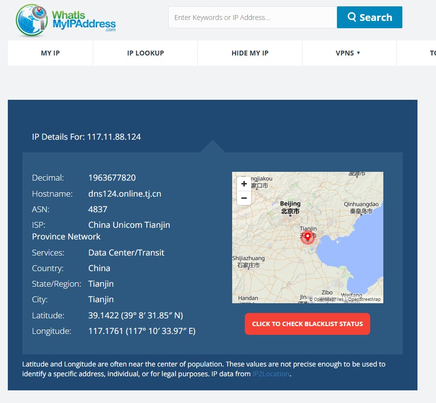
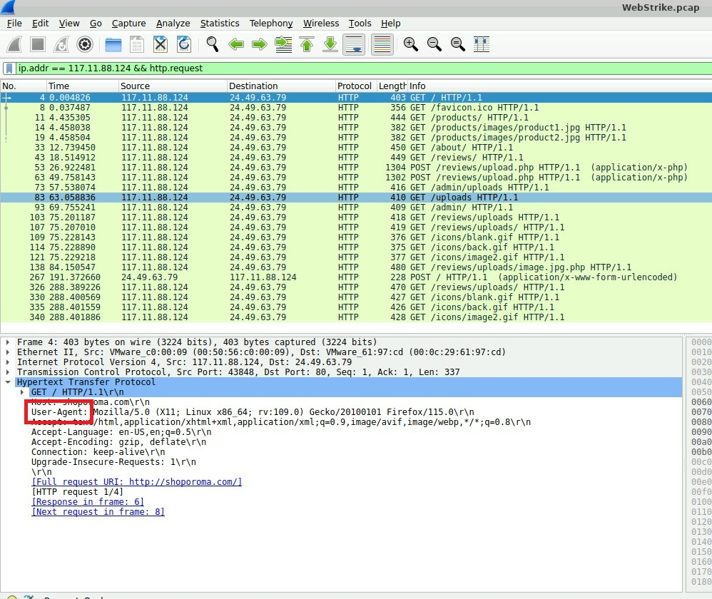
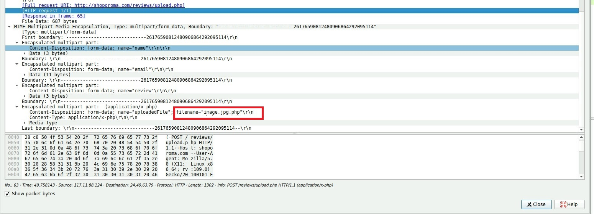

> **Автор:** Dronard  
> **Дата:** 2026-04-07  
> **Платформа:** CyberDefenders.org  
> **Задача:** WebStrike — Blue Team CTF  
> **Цель:** Анализ PCAP-трафика: веб-шелл, reverse shell, утечка данных  
> **Роль:** Blue Team / SOC Analyst Simulation  
> **Репозиторий:** [my-resume](https://github.com/sp9232046-tech/my-resume/)  
> **Статус:** ✅ Completed

---
# CyberDefenders Writeups

## Web Strike
**URL:** https://cyberdefenders.org/blueteam-ctf-challenges/webstrike/

### Цель задачи
Проанализировать сетевой трафик (WebStrike.pcap) в Wireshark для выявления:
- Факта компрометации веб-сервера
- Развертывания веб-шелла
- Reverse shell подключения
- Утечки данных

### Инструменты
- Wireshark — анализ PCAP-трафика
- Веб-сервис геолокации IP (https://whatismyipaddress.com/ip-lookup) — определение города по IP
- Виртуальная машина CyberDefenders — среда для анализа

### Ход решения
# Q1  ГЕОЛОКАЦИЯ
1. В меню выбрать: Statistics -> Conversations -> IPv4
2. Отсортировать по колонке "Packets" (по убыванию)
3. Найден внешний IP 117.11.88.124
4. Открыть в браузере: https://whatismyipaddress.com/ip-lookup. 
5. Ввести найденный IP -> увидим город

### Флаг/Ответ
Tianjin

# Q2 USER-AGENT
1. Фильтр: ip.addr == 117.11.88.124 && http.request
2. Раскрыть: Hypertext Transfer Protocol
3. Строка: User-Agent:Mozilla/5.0 (X11; Linux x86_64; rv:109.0) Gecko/20100101 Firefox/115.0

### Флаг/Ответ
Mozilla/5.0 (X11; Linux x86_64; rv:109.0) Gecko/20100101 Firefox/115.0

# Q3  ВЕБ-ШЕЛЛ
1. Фильтр: ip.addr == 117.11.88.124 && http.request.method == "POST"
2. Искать: Content-Type: multipart/form-data
3. Развернуть: MIME Multipart Media Encapsulation
4. Развернуть: Encapsulated multipart part
5. Искать: filename="*.php"
6. Ответ: имя файла

### Флаг/Ответ
image.jpg.php

# Q4  ДИРЕКТОРИЯ
1. Фильтр: http.request.uri contains "image.jpg.php"
2. Смотреть: Full request URI

### Флаг/Ответ
/reviews/uploads/

# Q5 REVERSE SHELL ПОРТ
1. Фильтр: ip.src == 24.49.63.79 && ip.dst == 117.11.88.124 && tcp.flags.syn == 1
2. Раскрыть: Transmission Control Protocol
3. Смотреть: Destination Port

### Флаг/Ответ
8080

# Q6 УКРАДЕННЫЙ ФАЙЛ 
1. Фильтр: ip.src == 24.49.63.79 && ip.dst == 117.11.88.24 && http
2. Ищи в URI или Form item:

### Флаг/Ответ
/etc/passwd

### Что узнал
1. Фильтрация трафика в Wireshark (http.request.method, ip.addr)
2. Анализ HTTP-заголовков (User-Agent, Content-Disposition)
3. Работа с геолокацией IP для Threat Intelligence
---
